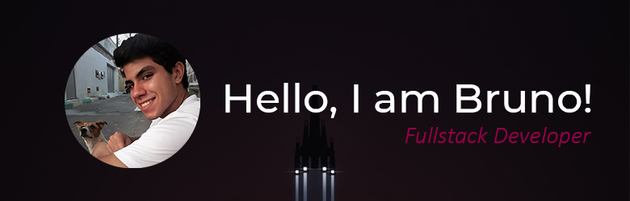

### About me 🧑:
I am a Systems Analysis and Development student (Bechelors) and a fullstack JavaScript│NodeJs developer. 
I also have some knowledge in Python!  
I am interested in furthering my skills and would 💖 to grow my knowledge in these Technologies.

 

<!--- 🔭 I’m currently working on Frontend Web Development & Android Development.-->
- 🌱 I’m currently learning JavaScript Development.
- 👯 I’m looking to collaborate with Fullstack Web and Android Developers.
- 🤔 I will learn MySQL, React and Vue!
- 😄 Pronouns: He/Him
- ⚡ Fun fact: I 💖 to code 24x7.

 
 
 
 
 

---

🛠 Languages and Tools:

   
<code></code>
<code></code>
<code></code>
<!-- <code></code>  -->
<code></code>
<code></code>
<code></code>
<!-- <code></code> -->
<code></code>

---

 🤠Connect with me: 
  

 

 

<!-- ### ✨ My Projects:
  
<a href="https://github.com/BrunoCyreno/The_Odin_Project/tree/main/Project-Recipes"> -->
---
Last Edited on: 13/11/2022
